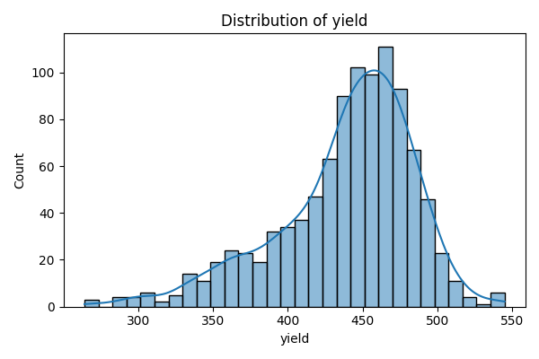
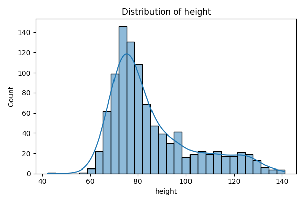
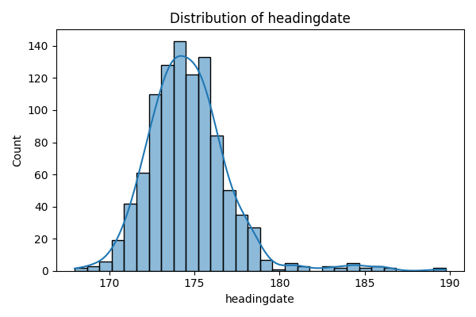
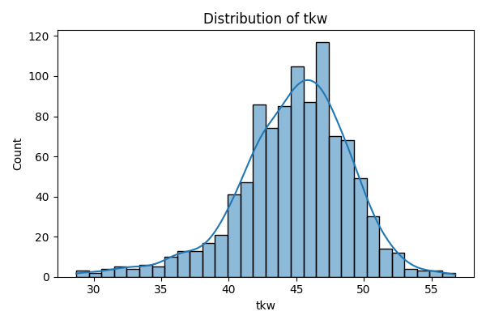
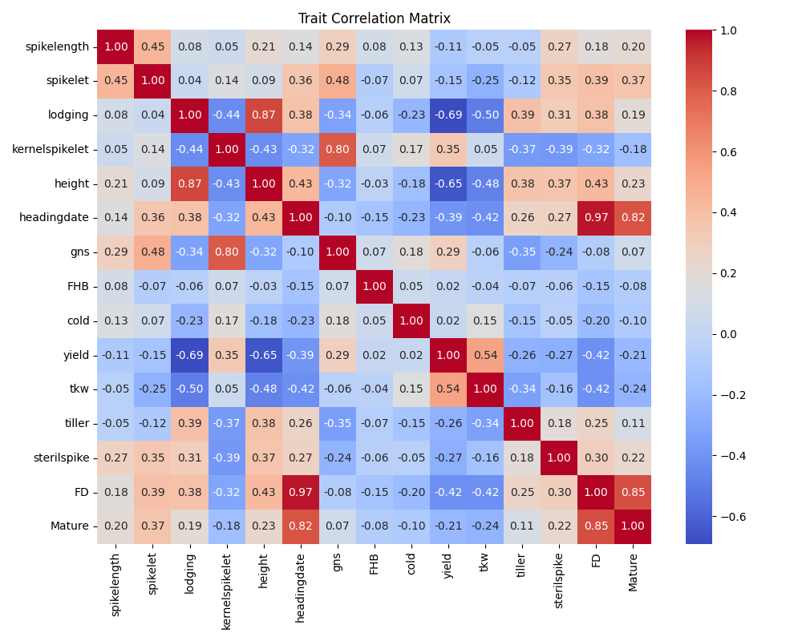

# 小麦表型数据EDA分析报告

## 1. 数据概览

本分析基于小麦1K群体的表型数据，共包含15个表型性状。所有性状均无缺失值，数据质量良好。

### 1.1 性状列表
- 产量相关：yield（产量）、tkw（千粒重）、gns（每穗粒数）、kernelspikelet（每小穗粒数）
- 发育相关：headingdate（抽穗期）、FD（开花期）、Mature（成熟期）
- 形态相关：height（株高）、spikelength（穗长）、spikelet（小穗数）、tiller（分蘖数）
- 抗性相关：lodging（倒伏）、FHB（赤霉病）、cold（耐寒性）、sterilspike（不育小穗）

## 2. 性状变异分析

### 2.1 方差分析
从方差分析结果可以看出，不同性状的变异程度差异较大：

表1：性状方差统计
| 性状 | 方差 | 缺失值比例 | 变异程度 |
|------|------|------------|----------|
| yield | 2103.01 | 0 | 高 |
| height | 305.07 | 0 | 高 |
| gns | 22.43 | 0 | 中 |
| tkw | 17.61 | 0 | 中 |
| headingdate | 6.23 | 0 | 中 |
| FD | 5.08 | 0 | 中 |
| FHB | 0.0005 | 0 | 低 |
| cold | 0.018 | 0 | 低 |
| kernelspikelet | 0.063 | 0 | 低 |

根据方差大小，我们可以将性状分为三类：
1. 高变异性状（方差 > 100）：yield、height
2. 中等变异性状（方差 1-100）：gns、tkw、headingdate、FD
3. 低变异性状（方差 < 1）：FHB、cold、kernelspikelet

### 2.2 分布特征
从分布图可以看出：
- 大多数性状呈现近似正态分布
- 部分性状（如yield、height）存在一定的偏态
- 抗性相关性状（如FHB、lodging）分布较为集中

主要性状分布图：

## 3. 性状相关性分析

### 3.1 相关性热图

### 3.2 高度相关性状对
表2：高度相关性状对（相关系数 > 0.8）
| 性状对 | 相关系数 | 生物学意义 |
|--------|----------|------------|
| headingdate - FD | 0.970 | 抽穗期与开花期高度相关，表明这两个发育阶段紧密相连 |
| headingdate - Mature | 0.822 | 抽穗期与成熟期显著相关，反映发育进程的连续性 |
| FD - Mature | 0.847 | 开花期与成熟期高度相关，表明生殖发育阶段的稳定性 |
| gns - kernelspikelet | 0.805 | 每穗粒数与每小穗粒数高度相关，反映产量构成因素的协同性 |
| height - lodging | 0.865 | 株高与倒伏高度相关，表明高秆品种更容易发生倒伏 |

### 3.3 产量相关性状
表3：产量相关性状的相关系数
| 性状 | 与产量的相关系数 | 影响方向 | 生物学解释 |
|------|------------------|----------|------------|
| tkw | 0.536 | 正相关 | 千粒重增加显著提高产量 |
| lodging | -0.691 | 负相关 | 倒伏严重降低产量 |
| height | -0.653 | 负相关 | 株高增加可能导致倒伏风险增加，从而降低产量 |

### 3.4 相关性分析结论

1. **发育相关性状的紧密关联**
   - 抽穗期、开花期和成熟期之间存在高度相关性（r > 0.8）
   - 这表明小麦的发育进程具有高度的时序性和稳定性
   - 建议：在育种中可以通过选择抽穗期来间接选择开花期和成熟期

2. **产量构成因素的协同性**
   - 千粒重与产量呈显著正相关（r = 0.536）
   - 每穗粒数与每小穗粒数高度相关（r = 0.805）
   - 建议：可以通过提高千粒重和每穗粒数来增加产量

3. **抗倒伏相关性状的关联**
   - 株高与倒伏高度相关（r = 0.865）
   - 倒伏与产量显著负相关（r = -0.691）
   - 建议：在育种中需要平衡株高和抗倒伏性

4. **性状间的权衡关系**
   - 株高增加可能提高生物量，但会增加倒伏风险
   - 产量提高需要平衡多个构成因素
   - 建议：采用多目标育种策略，综合考虑多个性状

5. **建模策略启示**
   - 高度相关的性状可以考虑联合建模
   - 可以利用性状间的相关性进行间接选择
   - 在模型设计中需要考虑性状间的交互作用

## 4. 建模建议

### 4.1 推荐建模性状

#### 主要建模性状
1. **yield（产量）**
   - 理由：
     - 最重要的经济性状
     - 变异度大（方差2103.01）
     - 与多个性状有显著相关性
   - 建模难度：中等
   - 预期效果：较好

2. **tkw（千粒重）**
   - 理由：
     - 重要的产量构成因素
     - 与产量正相关（0.536）
     - 变异度适中（方差17.61）
   - 建模难度：中等
   - 预期效果：好

3. **headingdate（抽穗期）**
   - 理由：
     - 重要的发育指标
     - 变异度适中（方差6.23）
     - 与多个性状高度相关
   - 建模难度：低
   - 预期效果：很好

#### 次要建模性状
1. **height（株高）**
   - 理由：
     - 重要的形态指标
     - 变异度大（方差305.07）
     - 与倒伏高度相关
   - 建模难度：低
   - 预期效果：好

2. **gns（每穗粒数）**
   - 理由：
     - 重要的产量构成因素
     - 变异度适中（方差22.43）
     - 与多个性状相关
   - 建模难度：中等
   - 预期效果：中等

### 4.2 对照组性状

1. **FHB（赤霉病）**
   - 理由：
     - 变异度极小（方差0.0005）
     - 与其他性状相关性弱
     - 抗性性状通常较难建模
   - 预期效果：较差

2. **cold（耐寒性）**
   - 理由：
     - 变异度小（方差0.018）
     - 与其他性状相关性弱
     - 环境依赖性强
   - 预期效果：较差

## 5. 建模策略建议

1. **多性状联合建模**
   - 对高度相关的性状对（如headingdate和FD）进行联合建模
   - 考虑使用多任务学习框架

2. **特征工程**
   - 对高变异性状进行标准化
   - 考虑使用性状组合作为新特征

3. **模型选择**
   - 主要性状：使用复杂模型（如CNN、XGBoost）
   - 次要性状：使用中等复杂度模型（如RandomForest）
   - 对照组：使用基础模型（如Lasso）

4. **验证策略**
   - 使用交叉验证评估模型性能
   - 对比不同性状的预测效果
   - 分析模型在不同环境下的稳定性

## 6. 结论

1. 建议优先对yield、tkw和headingdate进行建模，这些性状具有较好的变异度和可预测性。

2. 将FHB和cold作为对照组，用于评估模型在难预测性状上的表现。

3. 考虑使用多性状联合建模策略，充分利用性状间的相关性。

4. 建议进行多轮建模实验，对比不同模型在不同性状上的表现。 